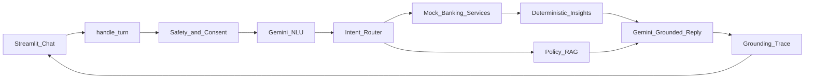
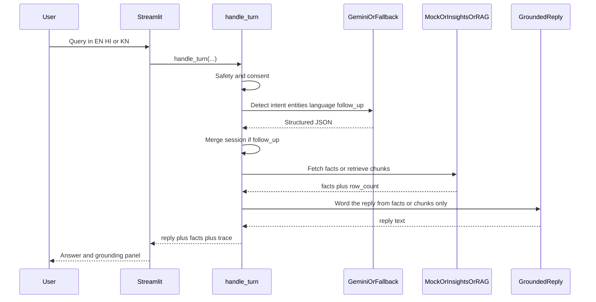
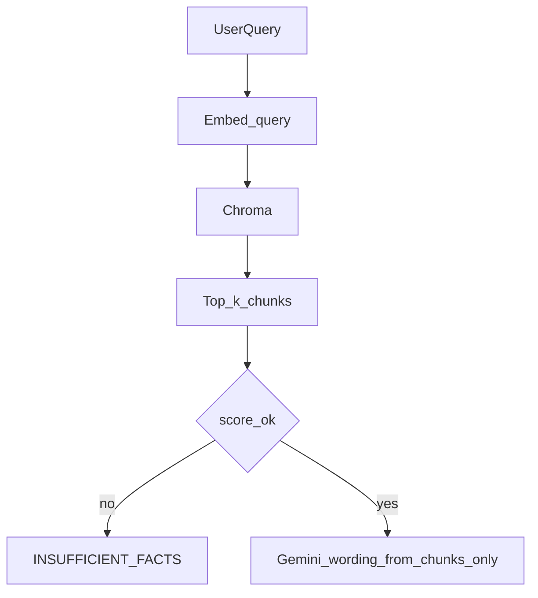
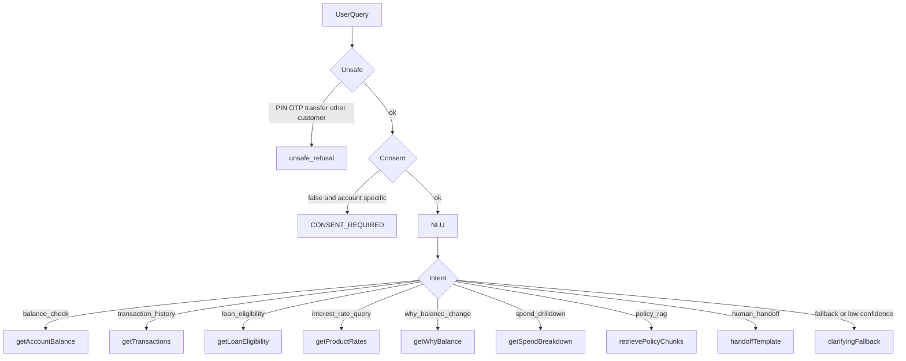

# Architecture Design — FinTrace

## High-level architecture



If Gemini is unreachable, NLU and Gen become the **keyword fallback** and **canned templates**. Mock services, the insight engine, and Chroma retrieve stay on the path. The demo must still run.

## Components

| Component | Owner | Responsibility |
|---|---|---|
| Chat UI | Builder 1 | Streamlit messages, language toggle, sidebar trace, latency, banner |
| `handle_turn` | Builder 3 | Orchestrate one turn (Streamlit calls this; FastAPI optional) |
| Safety / consent | Builder 2 + 3 | Refuse PIN/OTP/transfer/other-customer; check `consent_enabled` |
| Gemini NLU | Builder 3 | intent, entities, language, follow_up flag |
| Keyword fallback | Builder 3 | Same JSON shape without Gemini |
| Router | Builder 3 | Map intent → mock/insight/**RAG** |
| Mock banking services | Builder 2 | Balance, transactions, loans, rates |
| Policy RAG | Builder 4 | Embed, Chroma retrieve, return chunks + titles |
| Insight engine | Builder 4 | Why-balance, spend rollups (no LLM math) |
| Privacy masking | Builder 2 | Applied before facts leave the service |
| Grounded reply | Builder 3 | Gemini or templates; input is `facts_json` **or** `chunks` only |
| Session store | Builder 3 | Streamlit `st.session_state` plus process dict |
| Trace logger | Builder 3 | intent → API or retrieve → row_count → grounded |

## Request flow



## Grounding contract (anti-hallucination)

1. Gemini NLU returns JSON only: `intent`, `entities`, `language`, `follow_up`, `confidence`.
2. Backend calls a mock or insight function. That function is the **only** place rupees are calculated.
3. Gemini wording sees `facts_json` and the user query. It must not add, invent, or round amounts that are not in `facts_json`.
4. UI shows:

```text
AI Understanding  →  API called  →  N records  →  Response grounded
```

5. If `facts` are empty **or** no RAG chunk passes the similarity floor: refuse. Do not guess.
6. UI may also render key `facts` (balance, delta) **or** chunk titles next to the sentence.

## Policy RAG (must have)



Default: `k=3`, cosine similarity floor `0.35`.

Corpus = curated `data/kb/*.md` **union** cached Hugging Face rows. Do not download 2,631 rows during the live demo; ingest once into `data/kb/hf_chunks.json` and `data/chroma/`.

## Intent routing



Product rates, public FAQs, and **policy RAG** do **not** require consent. Balance, transactions, eligibility, why-balance, and spend **do**.

## Session store

In-process dictionary for 2 hours:

```text
sessions[session_id] = {
  customer_id, last_intent, last_entities, last_language, last_facts
}
```

Scale-up: Redis or the bank's session service. Same key shape.

## Why this architecture is feasible in 2 hours

- Mock data is local JSON
- Streamlit is one file, no npm
- Four people own four folders
- RAG is a **small** Chroma index (curated markdown + cached HF subset), not a live 2.6k download at demo time
- Gemini is two JSON prompts, not an agent framework
- Fallback means a missing API key does not kill the demo

## Why this architecture is scalable

| Today | Later |
|---|---|
| `GET /api/mock/accounts/{id}/balance` | Authenticated CBS balance API |
| `GET /api/mock/.../transactions` | Statement / ISO 20022 store |
| Insight engine on JSON | Same functions on warehouse extracts |
| Chroma + MiniLM | Bank document store / OpenSearch / Vertex RAG |
| Hugging Face cached subset | Full policy corpus + change-management |
| Gemini Flash | Any chat model behind the same JSON schema |
| Streamlit `session_state` | Redis + audit log |
| Streamlit i18n dict | CMS copy + NLU locale packs |

## Failure modes

| Failure | Behaviour |
|---|---|
| Missing `GEMINI_API_KEY` or timeout | Keyword NLU + canned templates |
| Unknown intent / confidence &lt; 0.5 | `fallback` clarifying question |
| Consent false | `CONSENT_REQUIRED` message, no facts |
| Empty insight or RAG result | Grounded refusal, offer transactions or policy search |
| Empty user message | `EMPTY_MESSAGE` |
| Chroma not built | Show ingest command; do not hallucinate policy |
